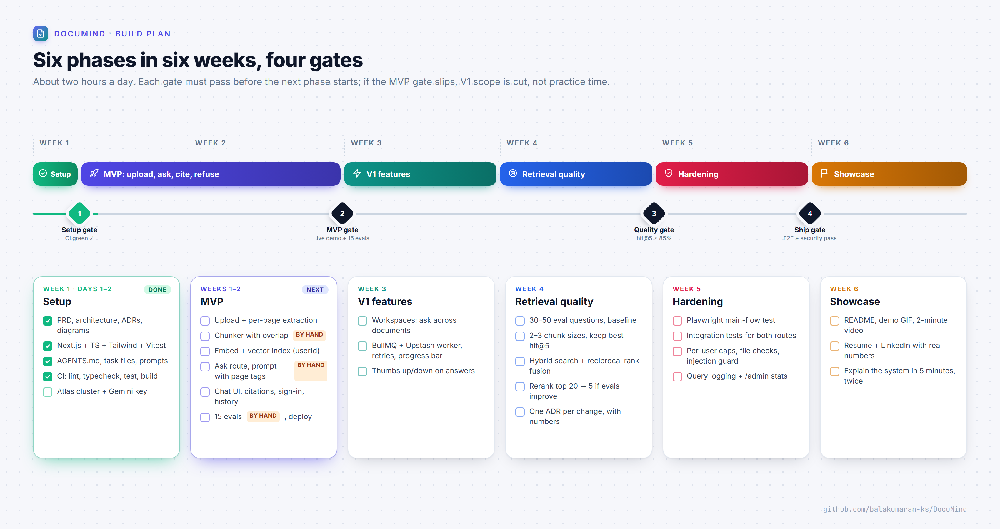

# DocuMind

**Chat with your PDFs.** Upload a document, ask questions, and get answers that cite the exact page, or an honest "that isn't in this document".

[](https://github.com/balakumaran-ks/DocuMind/actions/workflows/ci.yml)


> **Status:** setup complete; the MVP is in progress. Upload validation and per-page text extraction are built; storage, retrieval and the chat UI are next. See the [roadmap](#roadmap).


## What it does

- **Upload a text PDF** (up to 4 MB and 50 pages). Text is extracted and stored page by page.
- **Ask questions** and get a streamed answer grounded in the five most relevant passages.
- **Page-level citations:** every `[p. N]` in an answer is clickable and opens that page's text.
- **Refuses instead of guessing** when the document does not contain the answer.
- **Private by design:** Google sign-in, and every query and vector search is filtered by user.

## How it works

Uploads are parsed, chunked and embedded **once**. Each question then runs one filtered vector search and one streamed Gemini call, which keeps answers fast, cheap and traceable to a page.

| Ingest path | Ask path |
| --- | --- |
|  |  |

[docs/ARCHITECTURE.md](docs/ARCHITECTURE.md) covers the data model, API routes, security and deployment.

## Stack

| Layer | Choice | Why |
| --- | --- | --- |
| Frontend + API | Next.js (App Router), TypeScript, Tailwind CSS | One codebase and one deploy ([ADR-0001](docs/adr/0001-single-nextjs-app.md)) |
| Auth | Auth.js with Google sign-in | No passwords to store; little code |
| Database + vectors | MongoDB Atlas + Atlas Vector Search | Data and embeddings in one place ([ADR-0002](docs/adr/0002-mongodb-atlas-vector-search.md)) |
| PDF parsing | unpdf (PDF.js packaged for serverless) | Text per page, which citations depend on |
| LLM + embeddings | Gemini via the Vercel AI SDK | Free tier; the provider can be swapped in one line ([ADR-0003](docs/adr/0003-gemini-via-vercel-ai-sdk.md)) |
| Queue (V1) | BullMQ + Upstash Redis | Background ingestion with retries and progress |
| Tests + CI | Vitest, Playwright, GitHub Actions | Merges blocked unless every check passes |

## Evaluation

Retrieval and answer quality are measured on a hand-written eval set: 30–50 questions over public PDFs, each with the page that answers it, including questions whose answer is *not* in the documents. Results are committed with every change to chunking, retrieval or prompts, so each change has before/after numbers.

| Metric | Target | Baseline | Current |
| --- | --- | --- | --- |
| Retrieval hit@5 | ≥ 85% | — | — |
| Citation accuracy | ≥ 90% | — | — |
| Refusal on not-in-document questions | ≥ 90% | — | — |

## Roadmap



Scope and non-goals are in the [PRD](docs/PRD.md). Each slice of work has a task file with acceptance criteria in [docs/tasks](docs/tasks/README.md).

## Development practices

- **Tests first.** Every slice starts from its acceptance criteria and failing tests; the implementation follows.
- **Small pull requests.** One task per PR, kept under ~300 changed lines, each with a short summary of how the change works.
- **Decisions are recorded.** Every real choice has an [architecture decision record](docs/adr/README.md) with the alternatives considered.
- **CI is the gate.** Lint (no warnings allowed), typecheck, unit tests with coverage and a production build must pass before anything merges.
- **Retrieval changes are measured.** Chunking, retrieval and prompt changes ship with eval results.

## Run locally

Requires Node.js 22+ (24 recommended, see `.nvmrc`).

```bash
git clone https://github.com/balakumaran-ks/DocuMind.git
cd DocuMind
npm install
cp .env.example .env.local   # then fill in the values
npm run dev
```

The first integration-test run downloads a MongoDB binary into `.cache/mongodb-binaries` (about 800 MB on Windows, much less on Linux and macOS); later runs and `npm ci` reuse it.

Open http://localhost:3000. `GET /api/health` reports, by name only, any required environment variable that is missing or still holds a template placeholder such as `<db_username>`.

| Command | What it does |
| --- | --- |
| `npm run dev` | Development server |
| `npm run check` | Lint + typecheck + all tests |
| `npm test` | Unit and integration tests |
| `npm run test:unit` | Unit and component tests (fast, no database; components render in jsdom) |
| `npm run test:integration` | Integration tests against a temporary MongoDB |
| `npm run build` | Production build |
| `npm run db:indexes` | Create the Atlas Vector Search index (once per cluster) |
| `npm run diagrams` | Re-render the diagrams in `docs/assets/` |

### External services (all free tiers)

1. **MongoDB Atlas:** create an M0 cluster and a database user, and allow your IP address. Copy the connection string into `MONGODB_URI`, replacing both `<db_username>` and `<db_password>`. Then run `npm run db:indexes` once to create the vector search index.
2. **Gemini API:** create a key at [Google AI Studio](https://aistudio.google.com/apikey) and set `GOOGLE_GENERATIVE_AI_API_KEY`.
3. **Google OAuth:** create an OAuth client (Web application) in Google Cloud Console with the redirect URI `http://localhost:3000/api/auth/callback/google`, then set `AUTH_GOOGLE_ID` and `AUTH_GOOGLE_SECRET`. Generate `AUTH_SECRET` with `npx auth secret`.

## Documentation

| Doc | Contents |
| --- | --- |
| [PRD](docs/PRD.md) | Problem, user, MVP scope, non-goals, success metrics |
| [Architecture](docs/ARCHITECTURE.md) | Components, ingest and ask paths, data model, API, security |
| [ADRs](docs/adr/README.md) | One record per significant decision |
| [Tasks](docs/tasks/README.md) | Slices of work with acceptance criteria |
| [Diagrams](docs/diagrams/README.md) | Sources for every image in this README |

## License

[MIT](LICENSE)
