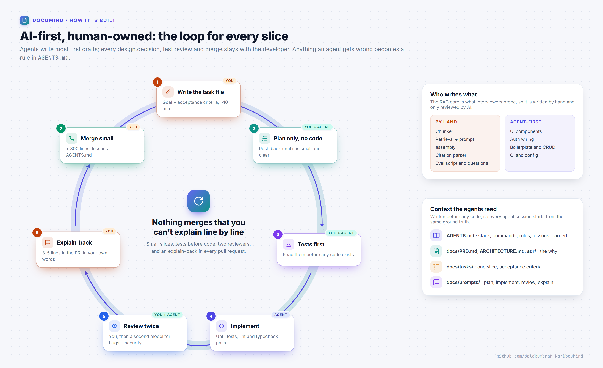

# DocuMind

**Chat with your PDFs.** Upload a document, ask questions, and get answers that cite the exact page, or an honest "that isn't in this document".

[](https://github.com/balakumaran-ks/DocuMind/actions/workflows/ci.yml)


> **Status:** Setup phase complete (repo, docs, CI, architecture). The MVP (upload → ask → cited answer) is in progress; see the [roadmap](#roadmap).


## What it does

- **Upload a text PDF** (up to 10 MB / 50 pages); text is extracted and stored page by page.
- **Ask questions** and get a streamed answer grounded in the five most relevant passages.
- **Page-level citations:** every `[p. N]` is clickable and opens that page's text.
- **Refuses instead of guessing** when the document doesn't contain the answer.
- **Private by design:** Google sign-in, and every query and vector search is filtered by user.

## How it works

Uploads are parsed, chunked and embedded **once**. Each question then runs one filtered vector search and one streamed Gemini call.

| Ingest path | Ask path |
| --- | --- |
|  |  |

More in [docs/ARCHITECTURE.md](docs/ARCHITECTURE.md): data model, API routes, security and deployment.

## Stack

| Layer | Choice | Why |
| --- | --- | --- |
| Frontend + API | Next.js (App Router), TypeScript, Tailwind CSS | One repo, one deploy ([ADR-0001](docs/adr/0001-single-nextjs-app.md)) |
| Auth | Auth.js with Google sign-in | Free, little code |
| Database + vectors | MongoDB Atlas + Atlas Vector Search | Data and embeddings in one place ([ADR-0002](docs/adr/0002-mongodb-atlas-vector-search.md)) |
| PDF parsing | pdfjs-dist | Text per page, which citations need |
| LLM + embeddings | Gemini via the Vercel AI SDK | Free tier; switching provider is one line ([ADR-0003](docs/adr/0003-gemini-via-vercel-ai-sdk.md)) |
| Queue (V1) | BullMQ + Upstash Redis | Background ingestion with retries |
| Tests + CI | Vitest, Playwright, GitHub Actions | Merges blocked unless everything passes |

## Eval results

Retrieval and answer quality are measured on a hand-written eval set (30–50 questions over public PDFs, including questions whose answer is *not* in the documents). Results will be committed with every change to chunking, retrieval or prompts.

| Metric | Target | Baseline | Current |
| --- | --- | --- | --- |
| Retrieval hit@5 | ≥ 85% | — | — |
| Citation accuracy | ≥ 90% | — | — |
| Refusal on not-in-document questions | ≥ 90% | — | — |

## Roadmap


Scope and non-goals are in the [PRD](docs/PRD.md); each slice has a task file in [docs/tasks](docs/tasks/README.md).

## How this was built

DocuMind is built **AI-first but human-owned**. AI agents write most first drafts; I write the specs, read every test before code exists, review every diff, and own every design decision. One rule keeps it honest: **nothing merges that I can't explain line by line.**



- Agents work from written context: [`AGENTS.md`](AGENTS.md) (stack, commands, rules, lessons learned), the [PRD](docs/PRD.md), [architecture](docs/ARCHITECTURE.md), [ADRs](docs/adr/README.md), [task files](docs/tasks/README.md) and [reusable prompts](docs/prompts/README.md).
- The RAG core (the chunker, retrieval + prompt assembly with citations, and the eval script) is **written by hand** and only reviewed by AI.
- UI, auth wiring, boilerplate and CI config are agent-first.
- Every pull request includes an explain-back: 3–5 lines, in my own words, on how the change works.

## Run locally

Requires Node.js 22+ (24 recommended, see `.nvmrc`).

```bash
git clone https://github.com/balakumaran-ks/DocuMind.git
cd DocuMind
npm install
cp .env.example .env.local   # then fill in the values
npm run dev
```

Open http://localhost:3000. `GET /api/health` reports which required environment variables are still missing (names only).

| Command | What it does |
| --- | --- |
| `npm run dev` | Dev server |
| `npm run check` | Lint + typecheck + unit tests (run before every commit) |
| `npm test` | Unit tests |
| `npm run build` | Production build |
| `npm run diagrams` | Re-render the architecture diagrams in `docs/assets/` |

### External services (all free tiers)

1. **MongoDB Atlas:** create an M0 cluster, a database user, and allow your IP. Copy the connection string into `MONGODB_URI`.
2. **Gemini API:** create a key at [Google AI Studio](https://aistudio.google.com/apikey) and set `GOOGLE_GENERATIVE_AI_API_KEY`.
3. **Google OAuth:** create an OAuth client (Web) in Google Cloud Console with the redirect URI `http://localhost:3000/api/auth/callback/google`, and set `AUTH_GOOGLE_ID` / `AUTH_GOOGLE_SECRET`. Generate `AUTH_SECRET` with `npx auth secret`.

## Documentation

| Doc | Contents |
| --- | --- |
| [PRD](docs/PRD.md) | Problem, user, MVP scope, non-goals, success metrics |
| [Architecture](docs/ARCHITECTURE.md) | Components, ingest and ask paths, data model, API, security |
| [ADRs](docs/adr/README.md) | One record per real decision |
| [Tasks](docs/tasks/README.md) | Feature slices with acceptance criteria |
| [Diagrams](docs/diagrams/README.md) | Sources for every image in this README |

## License

[MIT](LICENSE)
