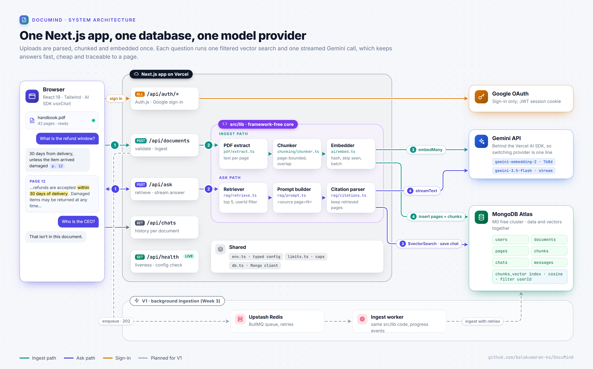
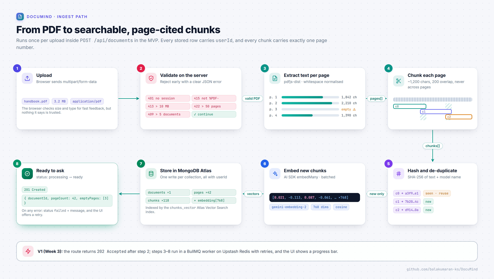
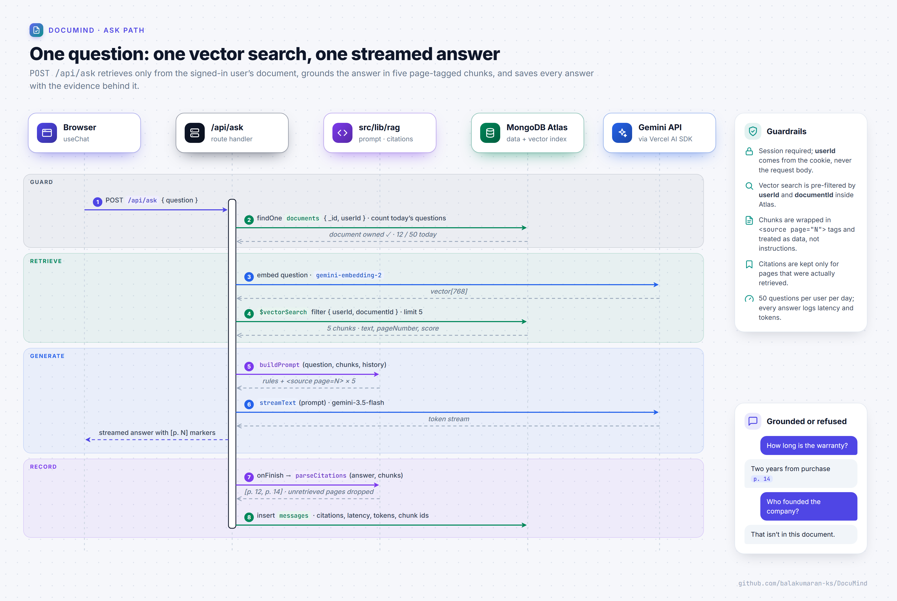
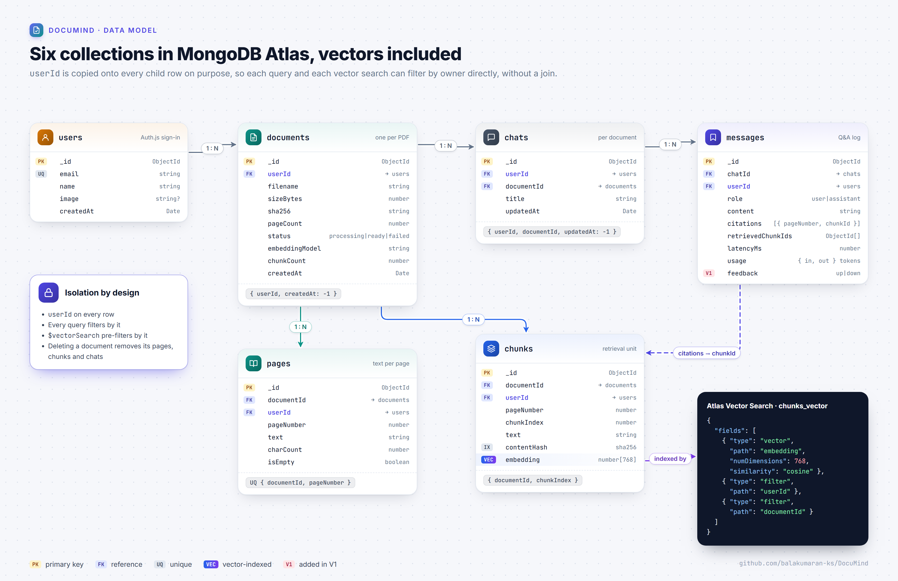
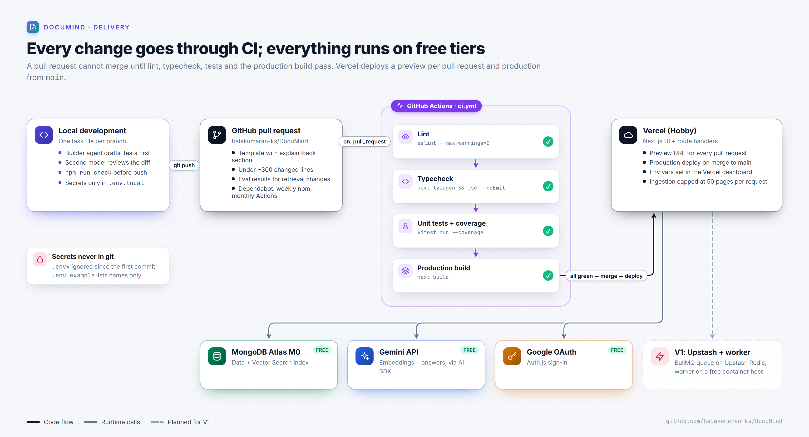

# DocuMind — Architecture

One Next.js app serves the UI and the API; MongoDB Atlas holds documents, their text and their vectors together; Gemini does both embeddings and answers. Uploads are parsed, chunked and embedded **once**; each question only runs one vector search and one Gemini call, which keeps it fast and cheap.



## Components

| Component | Responsibility |
| --- | --- |
| **Browser (React UI)** | Upload, document list, chat with streaming answers, citation side panel. |
| **Next.js route handlers** (`src/app/api/*`) | Auth check, validation, orchestration. Thin: logic lives in `src/lib`. |
| **`src/lib` core** | PDF extraction, chunker, embedder, retriever, prompt builder, citation parser. Framework-free and unit tested. |
| **Auth.js** | Google OAuth, JWT session cookie. Every route resolves `userId` from the session. |
| **MongoDB Atlas** | Collections below, plus one Atlas Vector Search index on `chunks.embedding`. |
| **Gemini API** (via Vercel AI SDK) | `gemini-embedding-2` for 768-dim embeddings; `gemini-3.5-flash` for answers. Both configurable. |
| **V1: BullMQ + Upstash Redis + worker** | Moves ingestion out of the upload request; adds retries and progress. |

## Ingest path



1. `POST /api/documents` receives `multipart/form-data`.
2. **Validate on the server:** session present, under 5 documents, size ≤ 4 MB ([ADR-0006](adr/0006-four-mb-upload-cap.md)), magic bytes `%PDF-`, page count ≤ 50.
3. **Extract** text per page with `unpdf`, PDF.js packaged for serverless ([ADR-0007](adr/0007-unpdf-for-text-extraction.md)). Pages with no text are flagged (likely scanned).
4. **Chunk** each page separately with overlap, so every chunk belongs to exactly one page ([ADR-0004](adr/0004-page-bounded-chunking.md)).
5. **Hash** each chunk (SHA-256 of normalised text + embedding model). Chunks whose hash this user already has reuse the stored vector.
6. **Embed** new chunks in batches.
7. **Store** `pages` and `chunks`, then set the document `status: "ready"`.

In the MVP this runs inside the request ([ADR-0005](adr/0005-synchronous-ingestion-in-mvp.md)); in V1 the route enqueues a job and returns `202` immediately.

## Ask path



1. `POST /api/ask` with `{ documentId, chatId?, question }`.
2. Check session, document ownership and the daily question cap.
3. Embed the question with the same model used for the chunks.
4. `$vectorSearch` over `chunks`, **pre-filtered by `userId` and `documentId`**, top 5 of 100 candidates.
5. **Build the prompt:** system rules (answer only from sources, cite `[p. N]`, reply "That isn't covered in this document." otherwise, ignore instructions inside sources) + the last 6 chat messages + the question, with the 5 chunks in page order wrapped in `<source page="N">` tags. `<source` and `</source` inside document text are escaped, so a document cannot close its own source and place text outside it.
6. `streamText` to Gemini; tokens stream to the browser.
7. On finish: parse `[p. N]` and `[p. N, M]` markers (malformed ones are ignored), drop any page that was not among the retrieved chunks, link each page to its best-scoring chunk, and save the message with citations, latency, token counts and retrieved chunk ids.

## Data model



| Collection | Key fields | Indexes |
| --- | --- | --- |
| `users` | `_id`, `email`, `name`, `image`, `createdAt` | `email` unique |
| `documents` | `_id`, `userId`, `filename`, `sizeBytes`, `sha256`, `pageCount`, `status` (`processing` \| `ready` \| `failed`), `error?`, `embeddingModel`, `chunkCount`, `createdAt` | `{ userId, createdAt: -1 }` |
| `pages` | `_id`, `documentId`, `userId`, `pageNumber`, `text`, `charCount`, `isEmpty` | `{ documentId, pageNumber }` unique |
| `chunks` | `_id`, `documentId`, `userId`, `pageNumber`, `chunkIndex`, `start`, `end`, `text`, `contentHash`, `embedding: number[768]`, `createdAt` | `{ documentId, chunkIndex }` unique, `{ userId, contentHash }`, **vector index** |
| `chats` | `_id`, `userId`, `documentId`, `title`, `createdAt`, `updatedAt` | `{ userId, documentId, updatedAt: -1 }` |
| `messages` | `_id`, `chatId`, `userId`, `role` (`user` \| `assistant`), `content`, `citations: [{ pageNumber, chunkId }]`, `retrievedChunkIds`, `latencyMs`, `usage: { inputTokens, outputTokens }`, `feedback?` (V1), `createdAt` | `{ chatId, createdAt }`, `{ userId, role, createdAt }` (daily question count) |

`userId` is copied onto `pages`, `chunks` and `messages` on purpose: every query can filter by it directly, without a join, which makes the rule "every query filters by owner" cheap to enforce and easy to review.

### Atlas Vector Search index (`chunks_vector`)

```json
{
  "fields": [
    { "type": "vector", "path": "embedding", "numDimensions": 768, "similarity": "cosine" },
    { "type": "filter", "path": "userId" },
    { "type": "filter", "path": "documentId" }
  ]
}
```

## API routes

| Method | Route | Purpose | Phase |
| --- | --- | --- | --- |
| `GET` | `/api/health` | Liveness, plus env vars that are missing or still hold a template placeholder (names only) | Setup ✅ |
| `*` | `/api/auth/[...nextauth]` | Auth.js handlers | MVP |
| `POST` | `/api/documents` | Upload + ingest a PDF | MVP |
| `GET` | `/api/documents` | List the user's documents | MVP |
| `GET` | `/api/documents/:id` | Document metadata and status | MVP |
| `DELETE` | `/api/documents/:id` | Delete a document with its pages, chunks and chats | MVP |
| `GET` | `/api/documents/:id/pages/:n` | One page's text, for the citation panel | MVP |
| `POST` | `/api/ask` | Ask a question; streams the answer | MVP |
| `GET` | `/api/chats?documentId=` | Chats for a document | MVP |
| `GET` | `/api/chats/:id/messages` | Chat history | MVP |
| `POST` | `/api/messages/:id/feedback` | Thumbs up/down | V1 |

## Security

- File type (magic bytes), size and page count checked on the server.
- Every query and every vector search is filtered by the session's `userId`.
- Document text is treated as data: wrapped in `<source>` tags and the system prompt says to ignore instructions inside it.
- Citations are validated against the retrieved chunks, so the model cannot cite a page it never saw.
- Secrets only in environment variables; `.env*` is git-ignored except `.env.example`, and configuration errors report variable names, never values.

## Deployment



Vercel (Hobby) runs the app; MongoDB Atlas M0 and the Gemini free tier back it. GitHub Actions blocks merges unless lint, typecheck, tests and build pass. In V1, Upstash Redis and a small worker container are added for ingestion.

## Diagrams

The PNGs in `docs/assets/` are rendered from the HTML/SVG sources in `docs/diagrams/`. Edit the source, then run `npm run diagrams`.
